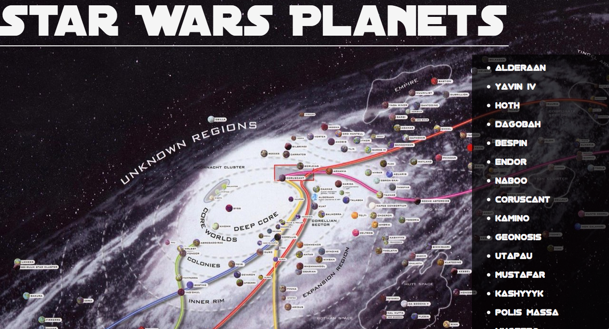
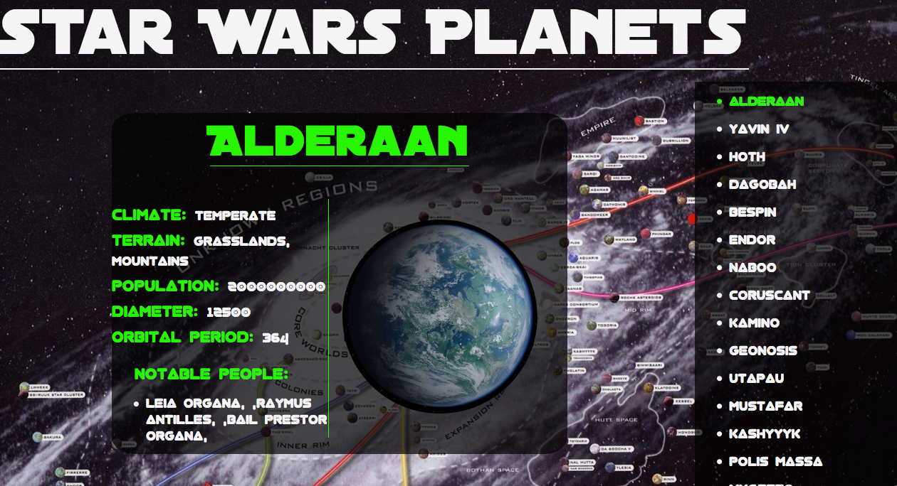
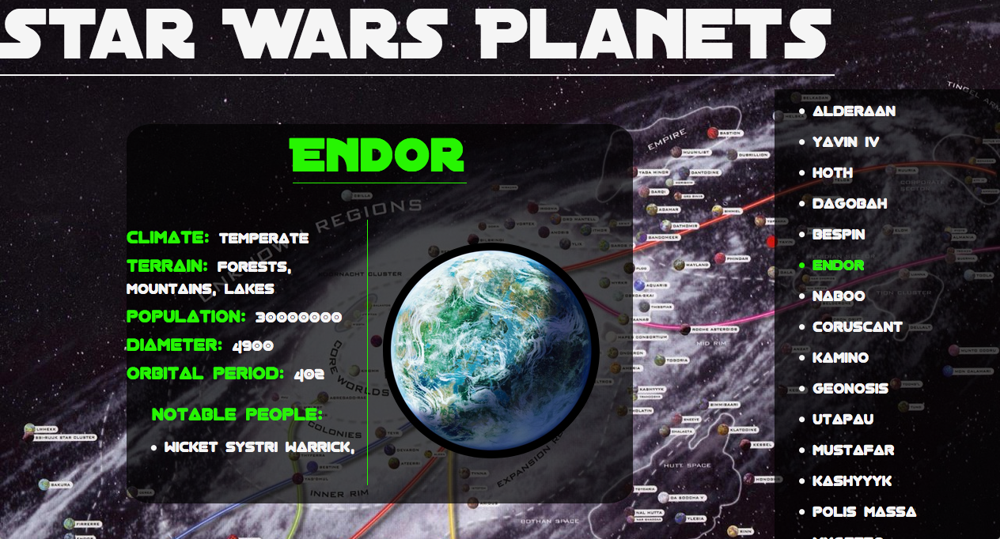

<h1>Star Wars Planetary Guide</h1>

<h2>Description</h2>
This small web all pulls from the public star wars API and allows the user to get compiled graphical information in different planets in the Star Wars universe.
<h2>Technologies Used</h2>
<li>HTML5</li>
<li>CSS3</li>
<li>JavaScript</li>
<li>jQuery</li>
<li>Star Wars API</li>

<h4>Basic Table:</h4>

<h4>Cards Dealt:</h4>

<h4>The House ALways Wins in The End:</h4>

